# Execution Plan - 테이블오더 서비스

## Detailed Analysis Summary

### Change Impact Assessment
- **User-facing changes**: Yes - 고객 태블릿 UI (광고, 메뉴, 장바구니, 주문, 사다리 타기), 관리자 대시보드 UI
- **Structural changes**: Yes - 전체 시스템 신규 구축 (Frontend + Backend + DB)
- **Data model changes**: Yes - 10개 이상의 엔티티 신규 설계 필요
- **API changes**: Yes - RESTful API + SSE 엔드포인트 전체 신규 설계
- **NFR impact**: Yes - 실시간 통신(SSE), JWT 인증, 역할 기반 접근 제어, 동시 접속 처리

### Risk Assessment
- **Risk Level**: Medium
- **Rollback Complexity**: Easy (Greenfield - 기존 시스템 없음)
- **Testing Complexity**: Complex (다중 사용자 유형, 실시간 통신, 세션 관리)

---

## Workflow Visualization

### Mermaid Diagram

```mermaid
flowchart TD
    Start(["User Request"])
    
    subgraph INCEPTION["INCEPTION PHASE"]
        WD["Workspace Detection<br/><b>COMPLETED</b>"]
        RA["Requirements Analysis<br/><b>COMPLETED</b>"]
        US["User Stories<br/><b>COMPLETED</b>"]
        WP["Workflow Planning<br/><b>IN PROGRESS</b>"]
        AD["Application Design<br/><b>EXECUTE</b>"]
        UG["Units Generation<br/><b>EXECUTE</b>"]
    end
    
    subgraph CONSTRUCTION["CONSTRUCTION PHASE"]
        FD["Functional Design<br/><b>EXECUTE</b>"]
        NFRA["NFR Requirements<br/><b>EXECUTE</b>"]
        NFRD["NFR Design<br/><b>EXECUTE</b>"]
        CG["Code Generation<br/><b>EXECUTE</b>"]
        BT["Build and Test<br/><b>EXECUTE</b>"]
    end
    
    Start --> WD
    WD --> RA
    RA --> US
    US --> WP
    WP --> AD
    AD --> UG
    UG --> FD
    FD --> NFRA
    NFRA --> NFRD
    NFRD --> CG
    CG --> BT
    BT --> End(["Complete"])
    
    style WD fill:#4CAF50,stroke:#1B5E20,stroke-width:3px,color:#fff
    style RA fill:#4CAF50,stroke:#1B5E20,stroke-width:3px,color:#fff
    style US fill:#4CAF50,stroke:#1B5E20,stroke-width:3px,color:#fff
    style WP fill:#4CAF50,stroke:#1B5E20,stroke-width:3px,color:#fff
    style AD fill:#FFA726,stroke:#E65100,stroke-width:3px,stroke-dasharray: 5 5,color:#000
    style UG fill:#FFA726,stroke:#E65100,stroke-width:3px,stroke-dasharray: 5 5,color:#000
    style FD fill:#FFA726,stroke:#E65100,stroke-width:3px,stroke-dasharray: 5 5,color:#000
    style NFRA fill:#FFA726,stroke:#E65100,stroke-width:3px,stroke-dasharray: 5 5,color:#000
    style NFRD fill:#FFA726,stroke:#E65100,stroke-width:3px,stroke-dasharray: 5 5,color:#000
    style CG fill:#4CAF50,stroke:#1B5E20,stroke-width:3px,color:#fff
    style BT fill:#4CAF50,stroke:#1B5E20,stroke-width:3px,color:#fff
    style INCEPTION fill:#BBDEFB,stroke:#1565C0,stroke-width:3px,color:#000
    style CONSTRUCTION fill:#C8E6C9,stroke:#2E7D32,stroke-width:3px,color:#000
    style Start fill:#CE93D8,stroke:#6A1B9A,stroke-width:3px,color:#000
    style End fill:#CE93D8,stroke:#6A1B9A,stroke-width:3px,color:#000
    
    linkStyle default stroke:#333,stroke-width:2px
```



### Text Alternative

```
INCEPTION PHASE:
  1. Workspace Detection      [COMPLETED]
  2. Requirements Analysis     [COMPLETED]
  3. User Stories              [COMPLETED]
  4. Workflow Planning         [IN PROGRESS]
  5. Application Design        [EXECUTE]
  6. Units Generation          [EXECUTE]

CONSTRUCTION PHASE (per-unit):
  7. Functional Design         [EXECUTE]
  8. NFR Requirements          [EXECUTE]
  9. NFR Design                [EXECUTE]
 10. Code Generation           [EXECUTE]
 11. Build and Test            [EXECUTE]
```

---

## Phases to Execute

### INCEPTION PHASE
- [x] Workspace Detection (COMPLETED)
- [x] Requirements Analysis (COMPLETED)
- [x] User Stories (COMPLETED)
- [x] Workflow Planning (IN PROGRESS)
- [ ] Application Design - **EXECUTE**
  - **Rationale**: 신규 프로젝트로 컴포넌트 식별, 서비스 레이어 설계, 컴포넌트 간 의존성 정의가 필요. 3가지 사용자 유형, 다중 API 도메인(Auth, Store, Menu, Order, Table, Advertisement), SSE 실시간 통신 등 복잡한 구조.
- [ ] Units Generation - **EXECUTE**
  - **Rationale**: Frontend(Vue.js)와 Backend(FastAPI)가 독립적인 프로젝트로 분리되어야 하며, 각각 별도의 설계/구현 단위로 관리 필요. DB 스키마도 별도 단위로 관리.

### CONSTRUCTION PHASE (per-unit)
- [ ] Functional Design - **EXECUTE**
  - **Rationale**: 10개 이상의 엔티티, 복잡한 비즈니스 로직(세션 라이프사이클, 주문 플로우, 사다리 타기), 데이터 모델 상세 설계 필요.
- [ ] NFR Requirements - **EXECUTE**
  - **Rationale**: SSE 실시간 통신, JWT 인증, 역할 기반 접근 제어, 동시 접속 처리, Security Extension 적용 등 NFR 요구사항이 다수 존재.
- [ ] NFR Design - **EXECUTE**
  - **Rationale**: NFR Requirements에서 도출된 패턴을 실제 설계에 반영 필요 (인증 미들웨어, SSE 구현 패턴, 에러 핸들링 등).
- [ ] Infrastructure Design - **SKIP**
  - **Rationale**: 로컬/온프레미스 배포로 클라우드 인프라 설계 불필요. 배포 구성은 Build and Test에서 다룸.
- [ ] Code Generation - **EXECUTE** (ALWAYS)
  - **Rationale**: 실제 코드 구현 필수.
- [ ] Build and Test - **EXECUTE** (ALWAYS)
  - **Rationale**: 빌드 및 테스트 지침 생성 필수.

### OPERATIONS PHASE
- [ ] Operations - PLACEHOLDER

---

## Unit 구성 계획 (예상)

| Unit | 설명 | 기술 스택 |
|---|---|---|
| **Unit 1: Backend API** | FastAPI 서버, REST API, SSE, 인증 | Python, FastAPI, MySQL, SQLAlchemy |
| **Unit 2: Customer Frontend** | 고객용 태블릿 웹 UI | JavaScript, Vue.js |
| **Unit 3: Admin Frontend** | 관리자용 웹 UI | JavaScript, Vue.js |

> 최종 Unit 구성은 Application Design 및 Units Generation 단계에서 확정됩니다.

---

## Success Criteria
- **Primary Goal**: 테이블오더 MVP 서비스 완성 (고객 주문 + 관리자 모니터링)
- **Key Deliverables**:
  - FastAPI Backend (REST API + SSE)
  - Vue.js Customer Frontend (광고, 메뉴, 장바구니, 주문, 사다리 타기)
  - Vue.js Admin Frontend (매장 관리, 메뉴 관리, 주문 모니터링, 테이블 관리)
  - MySQL Database Schema
  - Unit Tests (모든 레이어)
  - Build & Test Instructions
- **Quality Gates**:
  - 모든 API 엔드포인트 동작 확인
  - SSE 실시간 통신 2초 이내
  - JWT 인증 및 역할 기반 접근 제어 동작
  - Security Extension 규칙 준수 (애플리케이션 레벨)
